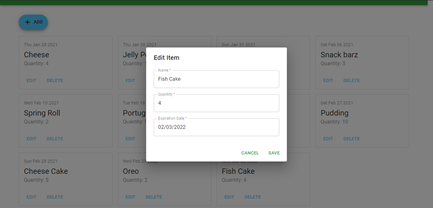

# Food Saver
A simple listing app for managing your consumed goods with an expiration date to reduce food waste. This app is built on JavaScript with React.js, Material UI, and for the firebase with Firebase.

> Currently this app only operates with simple CRUD operation.

## How to Run It Locally
1. Clone this repo
2. Open this project folder and type `npm install` in the console
3. Configure your Firebase config and insert all information on `firebase.js` file
4. Type `npm start` to run the project locally

## Features
1. View all item
   
   As you run this app locally, it will display the home page with all items you added to the app before.
   
   

2. Add a new item
   
   Click the **+ ADD** button and the form will appear. Insert the required data and click **ADD** button. The snack bar appears on the bottom center screen.
   
   

3. Edit an item
   
   Click the **EDIT** button on the item card you want to edit its information. Then change the information you want and click **SAVE** button to save the change.
   
   

4. Delete an item
   
   Click the **DELETE** button on the item card you want to delete. Then the dialog will appear to warn you if the action is irreversible. Click **DELETE** once again to proceed.
   
   